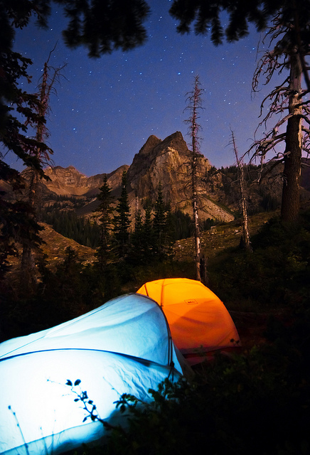

#Camping Checklist

##Shelter

 - [ ] Tent
 - [ ] Tent Stakes
 - [ ] Axe or Hammer
 - [ ] Camp Chairs

##Bedding

 - [ ] Air Mattress
 - [ ] Air Pump (car adapter)
 - [ ] Sleeping Bags
 - [ ] Sheets / Blankets
 - [ ] Pillows

##Cooking

 - [ ] Cooler
 - [ ] Ice
 - [ ] Firewood
 - [ ] Lighter
 - [ ] Kindling
 - [ ] Paper Plates
 - [ ] Plastic Utensils
 - [ ] Paper Towels
 - [ ] Trash Bags (Grocery Bags)
 - [ ] Marshmallow Roasters

##Misc

 - [ ] Soap
 - [ ] Sunscreen
 - [ ] Bug spray
 - [ ] Batteries
 - [ ] Flashlights / Lantern
 - [ ] Water Jug
 - [ ] Backpack
 - [ ] Pocket Knife
 - [ ] Fiching Pole(s)
 - [ ] Tackle Box
 - [ ] Fishing License
 - [ ] Waterproof Phone Case

##Clothing

 - [ ] Bathing Suits
 - [ ] Towels
 - [ ] Sweatshirts
 - [ ] Sweatpants
 - [ ] Flip Flops
 - [ ] Rain Coats
